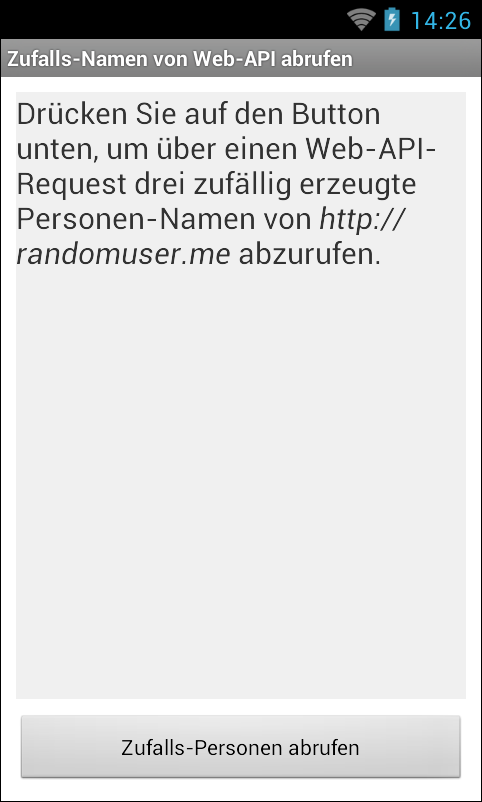
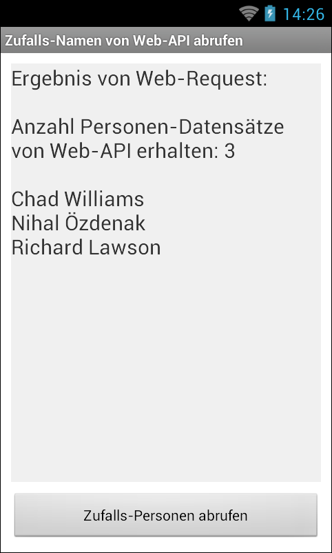

# Android-App "Zufallsnamen von Web-API" #

 

Simple Android app that fetches three random names from the Web API provided by [randomuser.me](https://randomuser.me/).

The author of this app is *NOT* related to the developer/provider of [randomuser.me](https://randomuser.me/).

 

URL / endpoint that is queried: https://api.randomuser.me/?results=3&gender=male&format=json

Not all data returned by the requests to this URL is displayed by the app.

 

Identifiers (names for classes, variables and methods), UI text and (JavaDoc) comments are in German only.

 

----

## Screenshots ##

 

  

 

----

## License ##

 

See the [LICENSE file](LICENSE.md) for license rights and limitations (BSD 3-Clause License).

 
